 

    

 

ChainGuard
---

Enable encryption and decryption of data based on a custom combination of cross chain and natural language statements.

Built for EthOnline 2023.

Demo video: https://youtu.be/zMrJAaM4SG0

## Inspiration

Traditional encryption is fairly basic i.e. are you the holder of this key, do you have access to this data.

With ChainGuard you can define much more rich criteria and triggers to share encrypted data, such as any natural language statement in combination with cross chain criteria to unlock a piece of data for the end user.

This enables triggers such as those based on world events, or things like inheritance, to only be triggered upon certain statements or when two parties regardless of chain origin agree that a piece of data should be unlocked for an end user. 

Or other examples where you might need a lawyer to mediate or validate a transaction or the release of a particular piece of data instead you can inspect blockchain states.

### Where existing apps fall short

Blockchain Mediation Services: There are services that facilitate dispute resolution on blockchains, but they may not offer the same level of encryption and decentralized access control as your solution.

Encryption Services: Standard encryption services provide data security, but they lack the dynamic, event-based triggers that your product aims to offer.

Blockchain-Based Inheritance Solutions: Some projects focus on blockchain-based inheritance, but they may not offer the same broad set of natural language and cross-chain criteria for unlocking data.

Zero-Knowledge Proof Solutions: While zero-knowledge proofs provide privacy, they might not offer the same level of natural language interaction and condition-based access.

Identity Verification Services: Identity verification services can confirm the authenticity of users, but they often are regulated by a singular authority or agency.

More specific examples: Keep Network is a decentralized key management system that allows users to store their private keys in a secure and distributed manner. However, it is still under development and does not support natural language statements or cross-chain transactions. Secret Network is a privacy-focused blockchain platform that allows users to store and manage data securely. However, it is still under development and does not support natural language statements or cross-chain transactions.

## What it does

ChainGuard can secure any piece of Filecoin data using any of the conditions below:
1) A cross chain transaction has occurred through Wormhole.
2) An UMA oracle precondition has been asserted and settled (user specified). Example use cases: revealing data only after a person has died or a particular sports team won an event.
3) A known address must be calling the contract, or be confirmed as part of a group or community via Sismo.

For every data upload, a smart contract is deployed that secures the payload. Every uploaded artifact gets a unique sharable url on ChainGuard that can be accessed at any time, but only reveals the data on condition satisfaction.

Cross chain transactions can occur from any other `DataContract` deployment to the deployed contract in order to satisfy the cross chain condition.

If the conditions above are met, the data is revealed and decrypted at the sharing url and delivered decrypted to the user on the page via distributed Filecoin storage and Lit protocol for decryption.

### Core functions
* Upload and lock dataset
* Define unlock criteria (both natural language, cross chain, and 3rd party apps).
* Make inactive or active (inactive=data no longer available for return/decrypt).

## Example contracts:

Live demo: https://chainguard23.vercel.app (Polygon testnet) 

Example upload: https://chainguard23.vercel.app/upload/0xBcb0149902f84b5D7ac521190B868b28dFDF369A (Polygon testnet)

Scroll Sepolia (verified): https://sepolia-blockscout.scroll.io/address/0x77967bF237Dc1D1C773c65d05b12578D7Efa6aC7

`npx hardhat verify --contract contracts/DataContractScroll.sol:DataContract --network scrollSepolia 0x77967bF237Dc1D1C773c65d05b12578D7Efa6aC7 "bafybeiap5yxspce7u252yvsmsrveu6bs722rgfcbj5brgskklrws2lgjnm" "statement" "disposition" "disposition" 0x00000000000000000000000000000000`

Polygon testnet: https://mumbai.polygonscan.com/address/0x941c69Fd343B4F7EB1eB26d194C622F6905585B2

## Technologies used

*Scroll Sepolia / Polygon ZkEVM and Mumbai*: Origin contract networks. Cross chain interactions low cost and facilitated by these core chains for the DataContract. Every transaction or data access attempt is logged to the contract history. Each network supports a different selection of conditions based on supported data providers/oracles.

*UMA*: ChainGuard allows users to optionally define custom unlocking conditions for their encrypted data. Users can specify natural language statements that need to be fulfilled before the data is decrypted. This feature ensures that data is only accessible when specific conditions are met, adding an extra layer of security. These statements are validated by UMA on each `DataContract`.

*Sismo*: Verify connected wallet claims beyond just connected address. . By integrating Sismo's verification system, the app can ensure that the wallets associated with users meet certain criteria or standards, enhancing the trustworthiness of the data access process.

*Filecoin*: Data upload and security with encryption by Lit Protocol. When users want to store their data securely, the app could utilize Filecoin to ensure that the data remains encrypted and protected until it is accessed and decrypted. This approach ensures the long-term security of sensitive data.

*Wormhole*: Cross-chain messaging. Enforce that data can only be accessed when a cross chain event occurs. Users can set conditions that trigger the decryption process based on events happening on other blockchains. This enhances the security and control over data access. The condition is satisfied when a wormhole relayer receives a message from the configured source.

*Lit Protocol*: Core encryption and decryption to IPFS and additional access criteria management. When users encrypt their data, Lit Protocol can provide robust encryption to secure the data. Additionally, it can manage access criteria, allowing users to define specific conditions for data decryption. The app can also use Lit Protocol to interact with IPFS for data storage and retrieval.

## Running the project (from scratch)

1. Copy `.env.sample` -> `.env`

2. Define variables in `.env` with your unique values.

3. [Optional] `/contracts` folder.  Ensure UMA OptimisticOracleV3Interface has `^0.8.16` (may require local edit). `yarn; yarn build` -> Contract output in `util/metadata.js`.

4. `yarn; yarn dev`. The app should now be running on port 3000.

Any repeated starts can be done with `yarn dev` once all environment variables are set.

### Deployment build

This command deploys the build site to vercel by default, feel free to edit the deploy command in `package.json` to your desired deployment destination.

`yarn build; yarn deploy`

### Screenshots

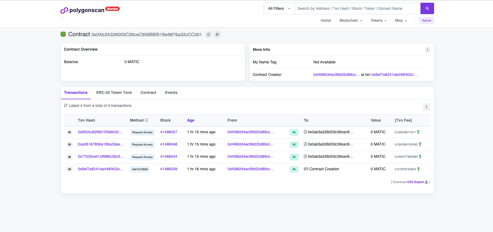 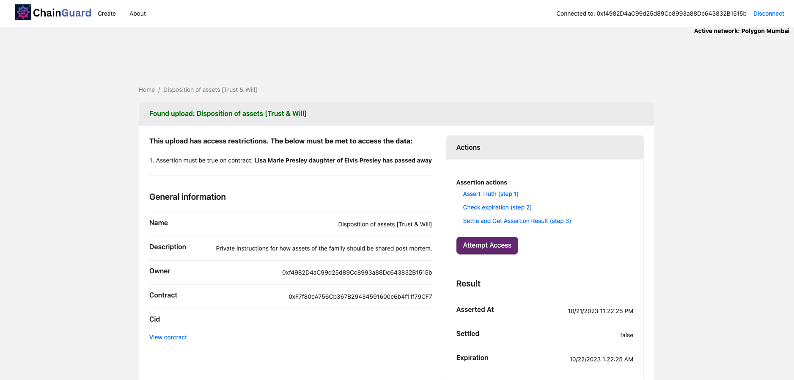 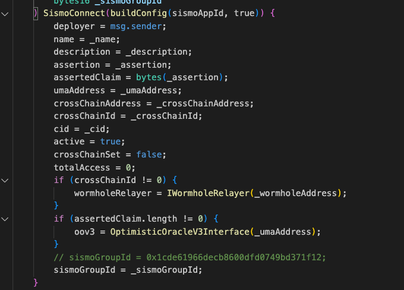 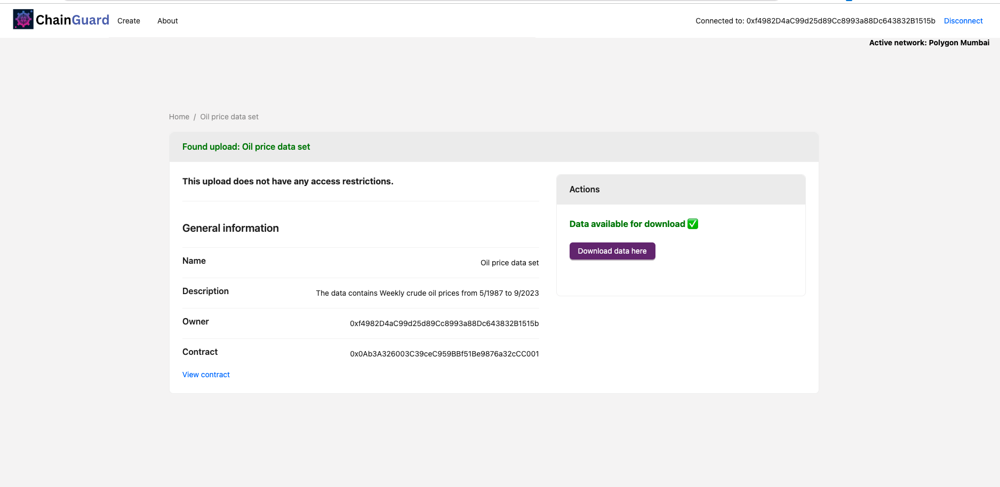 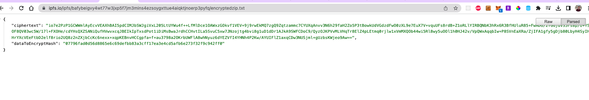 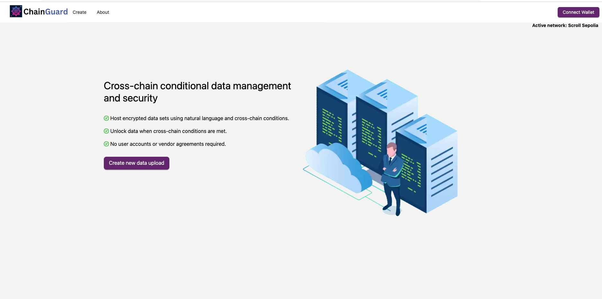 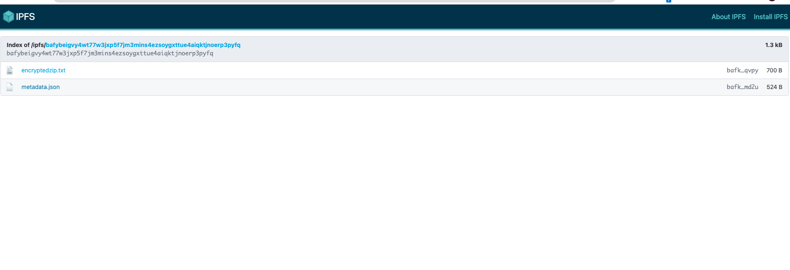 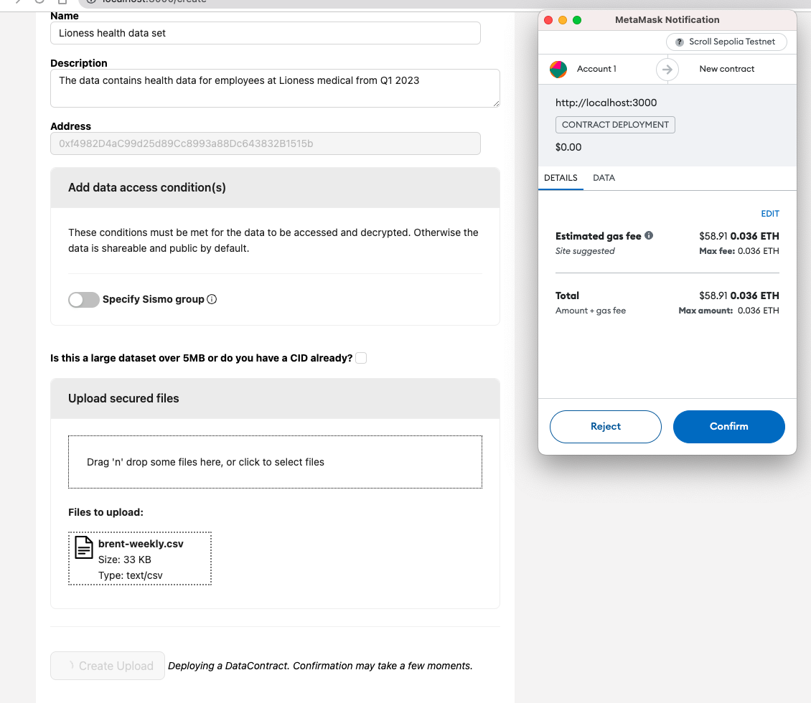 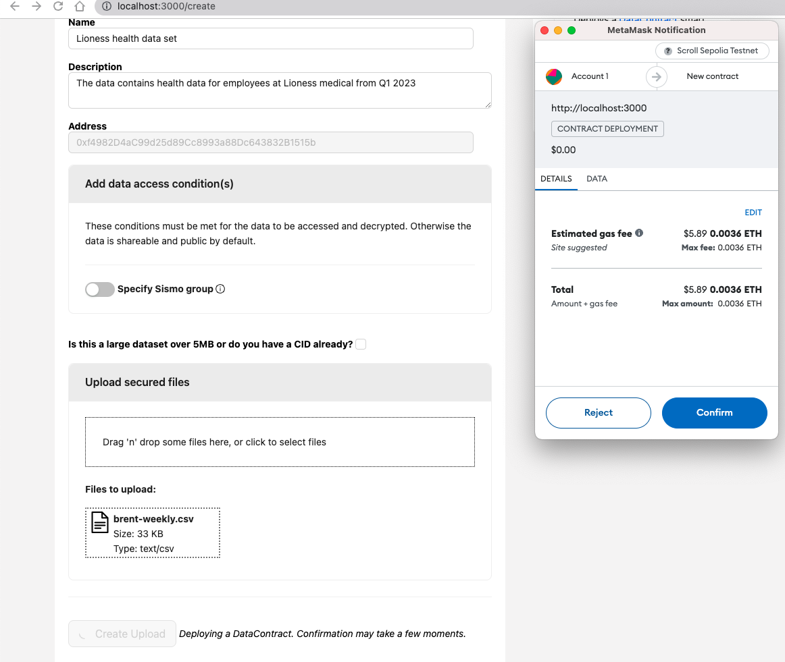 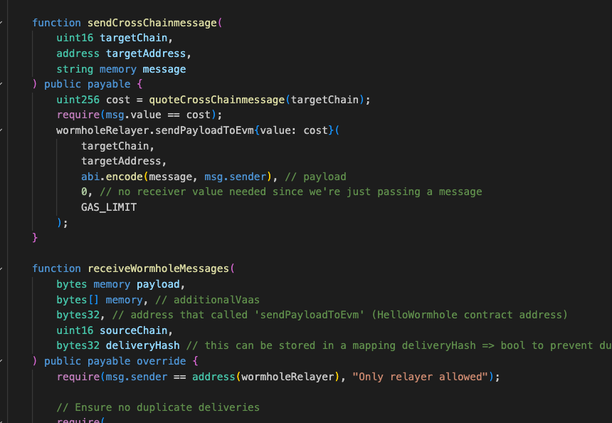 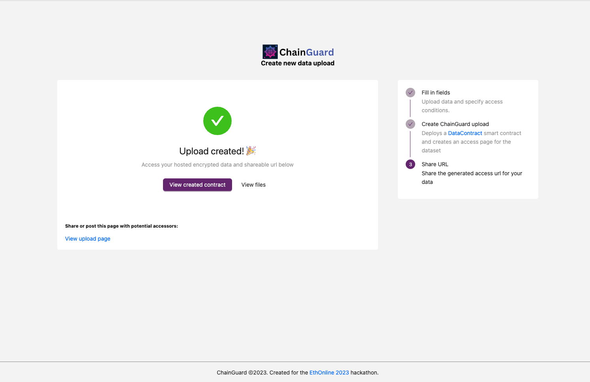 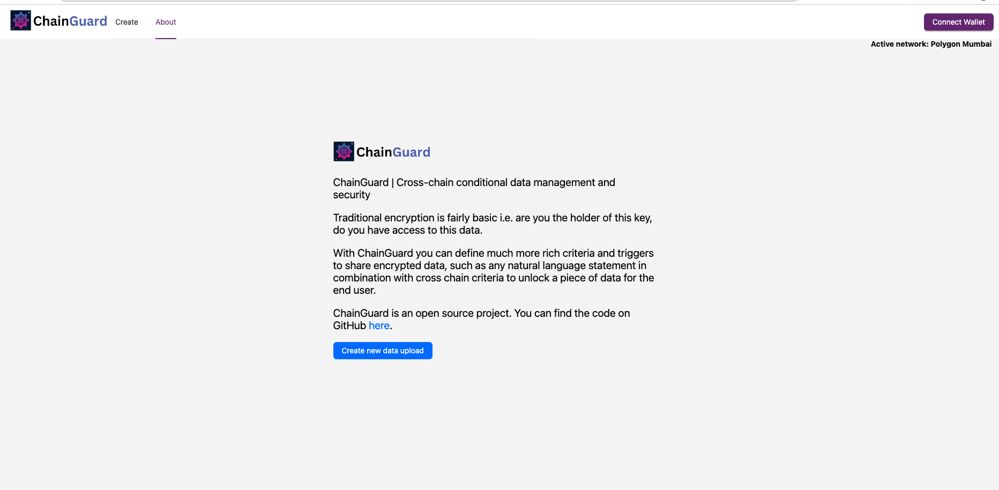 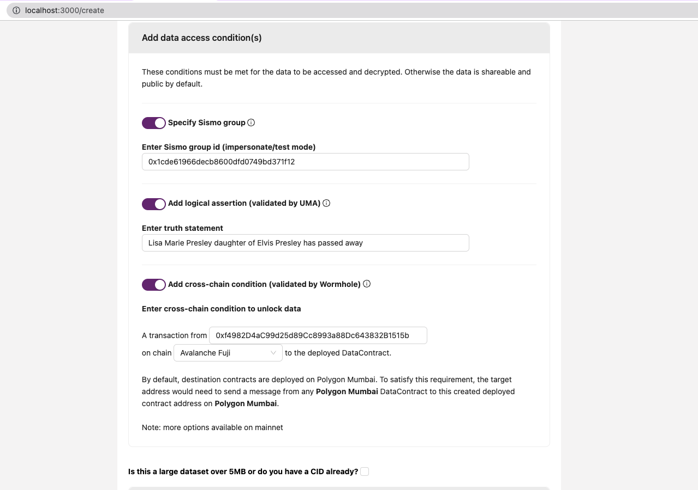

## Potential future work
1. Mainnet deployment and support: ChainGuard is currently deployable on Polygon Mumbai and Scroll Sepolia and is free to use - mainnet deployments would offer more long term guarantees and stability.
2. Security audit and review: Ensure the highest level of data security, privacy, and resistance to potential attacks. Do repeated testing to ensure that encrypted data can only be accessed when all the conditions are met.
3. Integration with additional blockchains: Cross chain interactions on the app require configuring source and destination addresses in the ChainGuard app - more sources could be added and maintained.

### Useful links
* https://ethglobal.com/events/ethonline2023/prizes
* https://github.com/wormhole-foundation/wormhole-solidity-sdk
* https://developer.litprotocol.com/v3/sdk/access-control/encryption
* https://docs.sismo.io/sismo-docs/welcome-to-sismo/readme